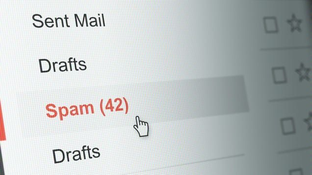

# Spam SMS Detector

**SMS Spam Detection using NLP & Machine Learning (Naive Bayes + TF-IDF)**

---

## Project Overview

This project demonstrates how to classify SMS messages as **spam** or **ham** (not spam) using **Natural Language Processing (NLP)** and **Machine Learning**. The pipeline includes data preprocessing, feature extraction with TF-IDF, training a **Multinomial Naive Bayes** model, evaluating performance, and making predictions on real-time messages.


---

## Dataset

The dataset `sms_spam.csv` contains **5,574 SMS messages** with two columns:

- **type** → `ham` (not spam) or `spam`  
- **text** → content of the SMS message  

**Dataset Distribution**:

| Type | Count | Percentage |
|------|-------|------------|
| Ham  | 4,827 | 86.6%      |
| Spam | 747   | 13.4%      |

---

## Steps in the Project

### 1. Import Libraries
Used Python libraries for data processing, NLP, and machine learning:
- `pandas`, `numpy` → Data manipulation
- `matplotlib`, `seaborn` → Data visualization
- `nltk` → Stopwords and text preprocessing
- `sklearn` → TF-IDF vectorization, train-test split, MultinomialNB, evaluation metrics

### 2. Data Preprocessing
- Checked for missing values
- Explored message lengths and distribution
- Created a **`length`** column for text analysis
- Removed punctuation and stopwords using `nltk`
- Encoded target labels: `ham = 0`, `spam = 1`

### 3. Feature Extraction
- Applied **TF-IDF Vectorization** on the cleaned text:
  - Converts text messages into numerical vectors
  - Captures the importance of words across messages

### 4. Train-Test Split
- Split dataset into **80% training** and **20% testing** sets
- Stratified split to maintain class balance

### 5. Model Training
- Trained a **Multinomial Naive Bayes** classifier
- Achieved **97.78% training accuracy**

### 6. Evaluation
- Test accuracy: **96.77%**
- **Classification Report**:

| Class | Precision | Recall | F1-score | Support |
|-------|-----------|--------|----------|---------|
| Ham   | 0.96      | 1.00   | 0.98     | 954     |
| Spam  | 1.00      | 0.78   | 0.87     | 161     |

- Confusion matrix visualizes correct and incorrect predictions
- Observations:
  - Model detects **ham messages very accurately**
  - Some spam messages are misclassified (false negatives)

### 7. Real-time Prediction
- Function `predict_message()` allows predicting new SMS messages:

```python
Enter a message to predict: Free entry in 2 a wkly comp to win FA Cup final
'The message is Spam'

Enter a message to predict: 20% discount on all jeans
'The message is Ham'
